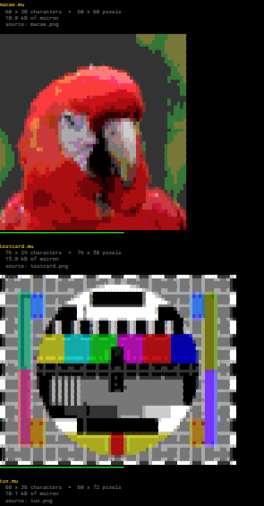

# img2mu — images on NomadNet pages

**Micron has no image support.** This turns a picture into a Micron colour block that
NomadNet, MeshChat, rBrowser and web gateways will all render as an image — using nothing
but coloured characters.



*`pages/imagetest.mu` rendering three converted blocks — a photograph, a test card and a
logo. Every one is made only of `▀` characters carrying a foreground and a background
colour; there is no image data on the page at all.*

*Rendered in MeshChatX, which pins its monospace cell width in CSS and so draws a straight
right edge — as do NomadNet's own terminal browser and reticulum.site. These are
byte-for-byte the same files that look smeared and wavy in plain MeshChat — see
[known renderer bugs](#frayed-right-edge-and-wavy-vertical-lines).*

---

## Contents

- [How it works](#how-it-works)
- [The colour trap](#the-colour-trap)
- [Requirements](#requirements)
- [Usage](#usage)
- [Options](#options)
- [Serving images from a NomadNet page](#serving-images-from-a-nomadnet-page)
- [Calibrating your viewer](#calibrating-your-viewer)
- [Getting a good result](#getting-a-good-result)
- [Size on the wire](#size-on-the-wire)
- [Known renderer bugs](#known-renderer-bugs)
- [Repository layout](#repository-layout)

---

## How it works

Every character cell is **U+2580 UPPER HALF BLOCK (`▀`)**. The glyph's *foreground* colour
paints the top half of the cell and its *background* colour paints the bottom half, so **one
character carries two vertically stacked pixels**:

```
`B<bottom colour>`F<top colour>▀          W × R characters  =  W × 2R pixels
```

A terminal character cell is about twice as tall as it is wide, so two pixels stacked inside
one cell come out very nearly square. That is what makes the trick work: the pixel grid keeps
the source image's aspect ratio directly, with no correction needed — *provided* the
renderer's cell really is 2:1. Not all of them are, which is what
[`--cell-aspect`](#calibrating-your-viewer) exists for.

The converter also emits a colour code **only when it changes**, rather than on every cell.
On typical images that is about a **3× size saving**, which matters a lot over LoRa.

---

## The colour trap

This is the thing that catches everyone, and it is worth understanding before you convert
anything.

Micron colour codes are exactly **three hex digits** after `` `F `` or `` `B `` — NomadNet's
parser reads `line[i+1:i+4]` and stops. Three hex digits *looks* like 4096 colours.

It is 216.

Urwid maps those digits onto the xterm-256 colour cube, and the mapping is lossy. Measured
against urwid directly:

```
digits 0,1,2 -> 0x00      3,4,5,6 -> 0x5f      7,8,9 -> 0x87
       a,b   -> 0xaf      c,d     -> 0xd7      e,f   -> 0xff
```

Six levels per channel, so **6³ = 216 reachable colours**. Feed in arbitrary hex and you get
colour shifts you cannot explain.

`img2mu.py` builds that exact 216-colour palette and quantises to it up front, so what Pillow
chooses is precisely what the viewer displays. Nothing is left to chance downstream.

---

## Requirements

- Python 3
- Pillow — `apt-get install python3-pil`

That is all. The converter has no other dependencies and writes plain text.

---

## Usage

```sh
./img2mu.py photo.png --width 100 > page.mu
```

Write straight into a NomadNet images directory, with a preview of what will actually be
rendered:

```sh
./img2mu.py photo.png --width 80 \
    --out ~/.nomadnetwork/images/photo.mu \
    --preview ~/.nomadnetwork/images/photo-preview.png
```

It reports the real cost on stderr:

```
80 x 40 characters  =  80 x 80 pixels  (7.8 kB on the wire)
```

**Always look at the preview.** It renders exactly what the viewer will show — including the
pixel-aspect stretch — so it catches problems that the source image does not reveal.

### Try it now

The repository ships a generated calibration target you can convert immediately:

```sh
python3 tools/make-calibration-target.py /tmp/target.png
./img2mu.py /tmp/target.png --width 40 --preview /tmp/preview.png
```

---

## Options

| option | default | meaning |
|---|---|---|
| `--width N` | `80` | width in **characters**, which is also the pixel width |
| `--cell-aspect A` | `0.5` | the renderer's cell width ÷ height. See [calibration](#calibrating-your-viewer) |
| `--dither` | off | Floyd–Steinberg. Usually wrong — see [below](#dither-is-usually-wrong) |
| `--preview PNG` | — | write a PNG of exactly what NomadNet will render |
| `--out MU` | stdout | write the block to a file |

Height is derived, never given: it follows from the width, the source aspect ratio and the
cell aspect. Rows are rounded up to an even number of pixels so the bottom half of the last
character row is real image rather than padding.

---

## Serving images from a NomadNet page

Converted blocks are raw Micron. They are not pages — they have no heading, no navigation,
and serving one directly gives a confusing half-page.

**Keep them outside `storage/pages/`.** Anything inside that directory is servable as a page
in its own right. The convention used here:

```
~/.nomadnetwork/images/          converted blocks and their source images
~/.nomadnetwork/storage/pages/   the page that displays them
```

`pages/imagetest.mu` is a ready-made gallery: it drops every `*.mu` it finds in the images
directory onto one page, so adding a picture is just running the converter with `--out` into
that directory and reloading. Nothing needs editing. If you keep the source `.png` beside the
block, the page names the image automatically.

```sh
install -Dm755 pages/imagetest.mu ~/.nomadnetwork/storage/pages/imagetest.mu
mkdir -p ~/.nomadnetwork/images
./img2mu.py logo.png --width 60 --out ~/.nomadnetwork/images/logo.mu
```

Two details that matter:

- The page starts with `#!c=0` so it re-executes on every visit. Without it a newly converted
  image will not appear until the cache is invalidated some other way.
- The blocks are printed **verbatim**. Escaping them on the way out turns the colour codes
  into literal text.

> A **new** page file needs a NomadNet restart before it is served at all; edits to an
> existing page take effect immediately.

---

## Calibrating your viewer

Half-block art assumes a character cell twice as tall as it is wide. Whether that holds
depends on the renderer's font and line height, and viewers disagree:

- **MeshChat** forces `pre { font-family: Roboto Mono Nerd Font; line-height: normal }`,
  giving roughly a 0.6 × 1.02 em cell.
- **reticulum.site** sets no font at all, so the browser's default monospace gives about
  0.6 × 1.2 em — exactly the 1:2 cell the technique assumes.

`--cell-aspect` compensates:

```
px_h = px_w × (h/w) × 2 × cell_aspect
```

**Measured values** — use these rather than calculating:

| viewer | `--cell-aspect` |
|---|---|
| NomadNet terminal UI | `0.5` |
| MeshChat (stock) | `0.5` |
| rBrowser, ASCII mode **off** | `0.5` |
| reticulum.site | `0.5` |
| rBrowser, ASCII mode **on** | `0.6` |

> MeshChatX pins its cell width explicitly in CSS (see
> [known renderer bugs](#frayed-right-edge-and-wavy-vertical-lines)), so it is worth running
> the calibration page against it rather than assuming it matches MeshChat.

So the default of `0.5` is right nearly everywhere. Only rBrowser's optional ASCII-mode
toggle, which sets `line-height: 1.0`, needs changing.

### Do not calculate it

Two attempts to derive this number from first principles were both wrong:

- **From font tables.** Roboto Mono Nerd Font reports a 0.600 em advance but 1.319 em
  ascent+descent, because its icon glyphs inflate the vertical metrics. That predicted images
  ~9% too narrow; the viewer was actually rendering them ~17% too *wide*. A browser's
  `line-height: normal` is not ascent + descent.
- **From counting pixels off a screenshot.** Also wrong.

**Measure it.** `pages/calibrate.mu` renders the same circle-inscribed-in-a-square at six
aspect values. Exactly one looks round in your viewer; that is your number.

```sh
python3 tools/make-calibration-target.py ~/.nomadnetwork/images/calib/calib-target.png
for a in 0.45 0.50 0.55 0.60 0.65 0.70; do
  ./img2mu.py ~/.nomadnetwork/images/calib/calib-target.png --width 40 \
      --cell-aspect $a --out ~/.nomadnetwork/images/calib/a$a.mu
done
install -Dm755 pages/calibrate.mu ~/.nomadnetwork/storage/pages/calibrate.mu
```

Then open the page and pick the circle that touches all four sides of its square.

---

## Getting a good result

### Crop tight — this matters more than any option

Viewers magnify a 60 × 60 block to roughly 880 pixels, about 15×, so every pixel has to earn
its place. Same photo, same budget:

- Whole frame — two birds and foliage → mush.
- One bird's head → eye, facial patch and beak all readable.

Crop to the single subject **before** touching `--width`.

### Subject matters — but check your renderer first

Low resolution obviously suits **logos and line art** best. Dense subjects need both enough
width *and* a renderer that does not fray.

The test card in the screenshot above is a good example: at 76 columns its castellations,
colour bars, greyscale steps and gratings are all legible in MeshChatX. The identical file
looks like mush in plain MeshChat, where the wavering columns destroy exactly the fine
vertical detail a test card is made of.

So before concluding an image is too dense to convert, view it somewhere that renders a
straight edge. A good deal of apparent conversion failure is renderer fraying.

### `--dither` is usually wrong

Even for photographs, at these sizes. Measured on a photo at 60 × 60:

| | size | look |
|---|---|---|
| undithered | 13.9 kB | clearly cleaner |
| dithered | 18.7 kB | noisy |

Two reasons. There are too few pixels for the eye to blend the dither pattern, so you see the
pattern instead of the tone. And dithering breaks up runs of identical colour, defeating the
run-length saving that keeps the block small.

Render both and compare the previews.

---

## Size on the wire

**Size is UTF-8 bytes, not characters.** `▀` is three bytes, so a character count understates
a page by roughly 3×. A 119 × 30 character block is about **20 kB**, which is significant
over LoRa. The converter always reports real bytes.

Anything wider than **78 columns** wraps on a standard 80-column terminal, and a wrapped
half-block image is destroyed rather than merely untidy. The converter warns above that.

Measured examples — the first two are the images in the screenshot above:

| source | characters | pixels | size |
|---|---|---|---|
| calibration target (flat colour) | 40 × 20 | 40 × 40 | 3.9 kB |
| macaw, cropped to the head | 60 × 30 | 60 × 60 | 10.8 kB |
| test card (dense detail) | 76 × 29 | 76 × 58 | 15.8 kB |
| photo, 119 columns | 119 × 30 | 119 × 60 | ~20 kB |

Size depends heavily on how much **flat colour** the image contains, because of the
run-length encoding — not on pixel count alone. The test card is barely larger in pixels
than the macaw but half again as big on the wire, because almost no two adjacent cells share
a colour.

---

## Known renderer bugs

### Frayed right edge and wavy vertical lines

**Not the `.mu` file — and it depends entirely on the viewer.**

| viewer | right edge |
|---|---|
| **NomadNet browser** (terminal) | **straight** |
| **MeshChatX 4.9.1** | **straight** |
| reticulum.site | straight |
| MeshChat | frayed |
| rBrowser | frayed |

**This is a browser-DOM problem and nothing else.** NomadNet's own UI is urwid in a real
terminal, which *is* a fixed character grid — there is no fractional advance and no per-line
box, so fraying cannot occur. Likewise reticulum.site emits the whole page as **one `<pre>`**,
a single text flow.

The frayed viewers build the page differently. MeshChat's `MicronParser.js` splits on
newlines and creates a `<div>` per line; independent block boxes plus a **fractional** glyph
advance — 0.6 em is 9.6 px at 16 px — means columns round differently on every line.

MeshChatX fixes it properly. It still builds per-line elements, but wraps each monospace cell
in a span with an **explicit width**:

```css
.Mu-mnt { display: inline-block; width: 0.6em; text-align: center; white-space: pre; }
```

Pinning the cell width makes the rounding deterministic and identical on every row, so the
edge stays straight. This is the single biggest reason to prefer MeshChatX over MeshChat for
viewing converted images.

Emitting a colour code on every cell was tried, on the theory that uneven span counts caused
the fraying. Both encodings frayed identically in the affected viewers, so the option was
removed. There is nothing the converter can do — it is a layout problem, not an encoding
one.

### Hairline banding between rows in MeshChat

Inline backgrounds fill the font content box rather than the line box, so `line-height:
normal` leaves a gap. Patching `line-height: 1` into MeshChat's CSS fixes it without a
rebuild, but tightens all text everywhere, so it is not recommended.

Full detail on both, plus everything else learned the hard way, is in
**[docs/PITFALLS.md](docs/PITFALLS.md)**.

---

## Repository layout

| path | what |
|---|---|
| `img2mu.py` | the converter |
| `pages/imagetest.mu` | NomadNet page that displays every converted block in a directory |
| `pages/calibrate.mu` | NomadNet page showing one circle at six cell-aspect values |
| `tools/make-calibration-target.py` | generates the circle-in-square target |
| `examples/` | a converted calibration target with its preview |
| `docs/PITFALLS.md` | every trap found while building this, keyed by symptom |

---

## Licence

MIT — see [LICENSE](LICENSE).
